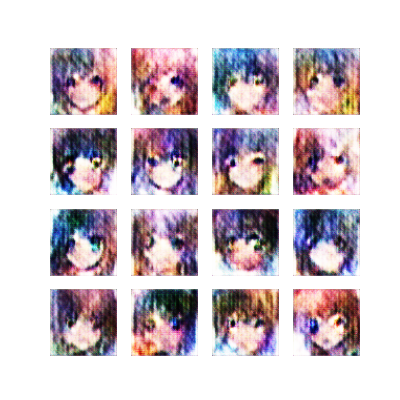
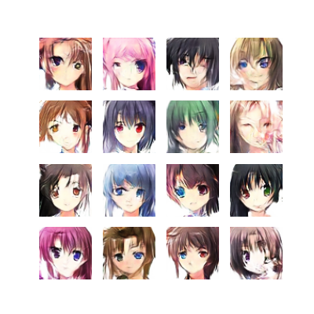

# Anime Face Generator using DCGAN

This project implements a **Deep Convolutional Generative Adversarial Network (DCGAN)** to generate anime-style character faces using TensorFlow and Keras. The model is trained on the [Anime Face Dataset](https://www.kaggle.com/splcher/animefacedataset) and produces high-quality synthetic images after training for several hundred epochs.

<p align="center">
  
  
</p>

---

## Project Highlights

- Trained on 64×64 anime character face images
- Clean DCGAN implementation using TensorFlow 2.x
- Saves generated image grids every 50 epochs
- Fully annotated and modular code
- Compatible with Kaggle, Colab, and local machines

---

## Model Architecture

### Generator
- Dense projection from latent space (100-dim)
- Upsampling using `Conv2DTranspose` layers
- Batch normalization and `LeakyReLU` activations
- Final output layer uses `tanh` to produce RGB images in [-1, 1]

### Discriminator
- 3-layer CNN with stride and dropout
- `LeakyReLU` activations for non-linearity
- Final dense layer outputs real/fake score (no activation)

---

## Project Structure

```

anime-gan/
│
├── anime\_gan.ipynb          # Main notebook with explanations and results
├── anime\_gan.py             # Standalone script version (optional)
├── requirements.txt         # Dependencies list
├── outputs/                 # Saved sample images every 50 epochs
│   ├── anime_epoch_001.png
│   ├── anime_epoch_050.png
│   └── anime_epoch_100.png
└── README.md                # Project overview

````

---

## Installation

Install required packages:

```bash
pip install -r requirements.txt
````

Or manually install:

```bash
pip install tensorflow matplotlib pillow tqdm numpy
```

---

## Dataset

This project uses the **Anime Face Dataset** from Kaggle:

* [Anime Face Dataset](https://www.kaggle.com/splcher/animefacedataset)
* Directory: `/kaggle/input/animefacedataset/images`

The images are resized to `64x64` and normalized to `[-1, 1]`.

---

## Training

To train the model, run the notebook or execute the script:

```bash
python anime_gan.py
```

The model saves generated images to `./outputs/` every 50 epochs.

---

## Outputs

| Epoch 001                          | Epoch 50                            | Epoch 100                            |
| ---------------------------------- | ------------------------------------ | ------------------------------------ |
|  |  |  |


---

## Author

**Moustafa Mohamed**

AI Developer & Kaggle Notebooks Expert

[LinkedIn](https://www.linkedin.com/in/moustafamohamed01/) | [GitHub](https://github.com/MoustafaMohamed01) | [Kaggle](https://www.kaggle.com/moustafamohamed01)

---
