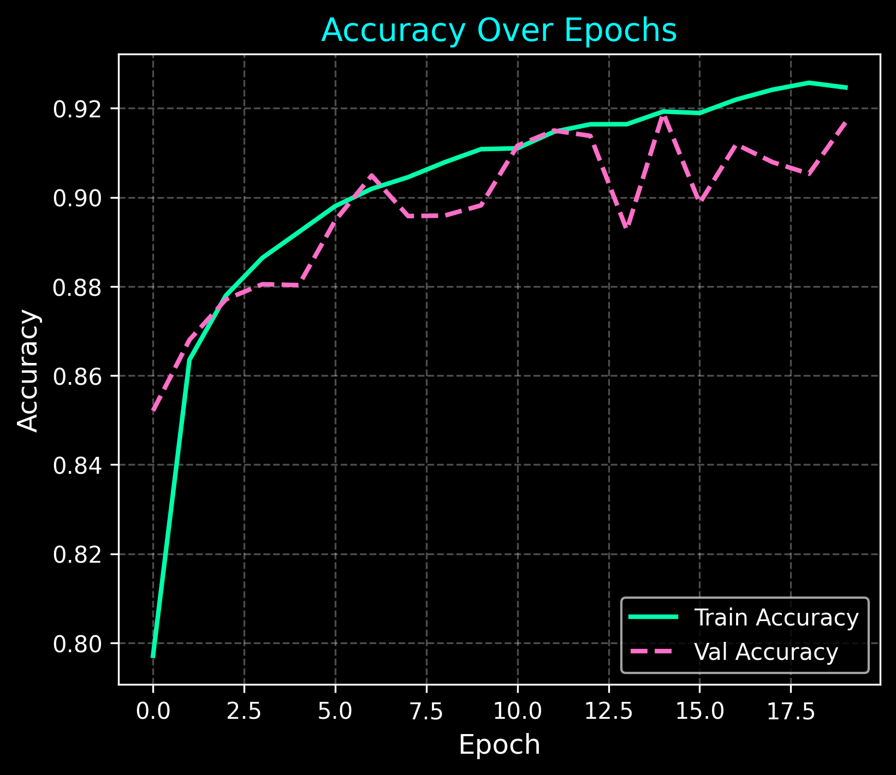
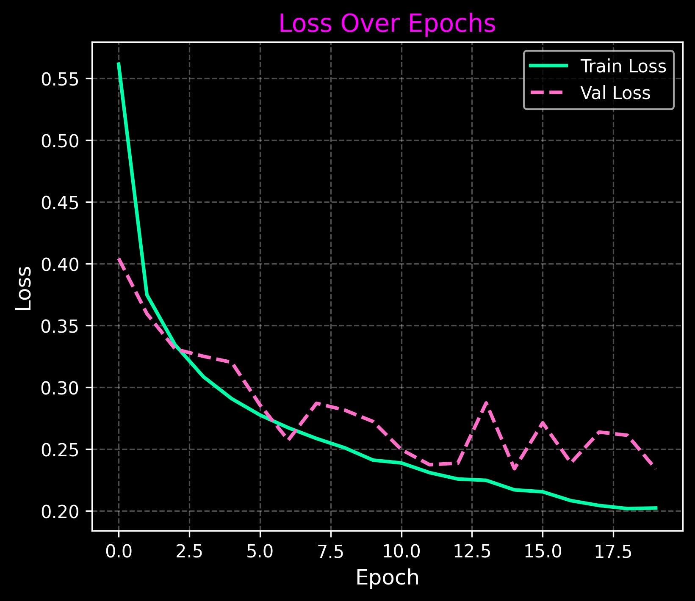

# Fashion MNIST - Image Classification with CNNs

A deep learning project that classifies clothing images from the Fashion MNIST dataset using a Convolutional Neural Network (CNN). The model is trained with TensorFlow/Keras and includes training visualization, callbacks, and dark-themed performance plots.

---

## Project Highlights

- **Dataset**: [Fashion MNIST](https://github.com/zalandoresearch/fashion-mnist) - 28x28 grayscale images of 10 clothing categories
- **Architecture**: CNN with Batch Normalization, Dropout, and MaxPooling
- **Loss**: Sparse Categorical Crossentropy
- **Optimizer**: Adam
- **Callbacks**: EarlyStopping and ModelCheckpoint
- **Visualization**: Dark-themed accuracy and loss plots

---

## Folder Structure

```

fashion-mnist-image-classification/
├── fashion-mnist-image-classification.ipynb    # Notebook version
├── fashion-mnist-image-classification.py       # Python script version
├── requirements.txt                            # Project dependencies
├── README.md                                   # Project documentation
└── images/                                     # Training plots 
    ├── model_accuracy_20250622_233613.png
    └── model_loss_20250622_233613.png

````

---

## Installation

### 1. Clone the Repository

```bash
git clone https://github.com/MoustafaMohamed01/DL-Projects.git
cd DL-Projects/fashion-mnist-image-classification
````

### 2. Install Dependencies

```bash
pip install -r requirements.txt
```

---

## How to Run

### Python Script

```bash
python fashion-mnist-image-classification.py
```

### Jupyter Notebook

Open and run the cells in:

```bash
fashion-mnist-image-classification.ipynb
```

---

## Sample Output

<p align="center">
  
  
</p>

---

## Model Performance

| Metric            | Value                           |
| ----------------- | ------------------------------- |
| **Test Accuracy** | \~91%                        |
| **Loss Function** | Sparse Categorical Crossentropy |
| **Input Shape**   | 28 × 28 × 1                     |

---

## Requirements

* `TensorFlow >= 2.16`
* `NumPy >= 1.22`
* `Matplotlib >= 3.7`

See [requirements.txt](./requirements.txt) for the full list.

---

## Author

**Moustafa Mohamed**
Aspiring AI Developer
[LinkedIn](https://www.linkedin.com/in/moustafamohamed01) | [Kaggle](https://www.kaggle.com/moustafamohamed01) | [Portfolio](https://moustafamohamed.netlify.app/)

---
