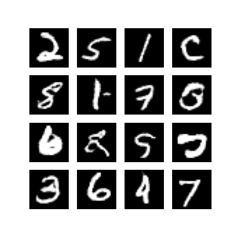

# MNIST GAN - Generate Handwritten Digits with Deep Learning

This project implements a **Generative Adversarial Network (GAN)** using TensorFlow to generate realistic handwritten digit images based on the MNIST dataset. It's a complete deep learning pipeline including model building, training, evaluation, and sample image generation.

<p align="center">
  
</p>

---

## Project Highlights

- Fully functional GAN (Generator + Discriminator)
- Trained on MNIST dataset (28x28 grayscale digits)
- Uses Binary Crossentropy loss with label smoothing
- Optimized with Adam (β₁ = 0.5) for GAN stability
- Saves image outputs every epoch for visual tracking
- Saves first and last epoch results to a dedicated folder

---

## Folder Structure

```bash
mnist-gan/
├── mnist_gan_full_pipeline.ipynb     # Full Jupyter notebook version
├── mnist_gan_full_pipeline.py        # Script version of the training pipeline
├── gan_generated_digits/             # Auto-generated images during training
│   ├── image_at_epoch_0001.png
│   └── image_at_epoch_0100.png
├── generated_digits/                 # Copied images from first and last epochs
├── requirements.txt                  # Dependencies
└── README.md                         # Project overview (this file)
````

---

## Installation & Setup

### 1. Clone the repo

```bash
git clone https://github.com/MoustafaMohamed01/DL-Projects.git
cd DL-Projects/mnist-gan
```

### 2. Create virtual environment (optional but recommended)

```bash
python -m venv venv
source venv/bin/activate  # or venv\Scripts\activate on Windows
```

### 3. Install dependencies

```bash
pip install -r requirements.txt
```

---

## How to Run

### Option 1: Python Script

```bash
python mnist_gan_full_pipeline.py
```

### Option 2: Jupyter Notebook

```bash
jupyter notebook
# Open `mnist_gan_full_pipeline.ipynb`
```

> The generator will start producing digits every epoch, and sample images will be saved in the `generated_digits/` folder.

---

## Example Outputs

| Epoch 1                                                               | Epoch 100                                                             |
| --------------------------------------------------------------------- | --------------------------------------------------------------------- |
|  |  |

---

## Requirements

All dependencies are listed in `requirements.txt`. Key ones include:

* `tensorflow >= 2.11`
* `matplotlib`
* `numpy`
* `pillow`

Install them using:

```bash
pip install -r requirements.txt
```

---

## Author

**Moustafa Mohamed**
[GitHub](https://github.com/MoustafaMohamed01) | [Kaggle](https://www.kaggle.com/moustafamohamed01) | [LinkedIn](https://www.linkedin.com/in/moustafamohamed01)

---
